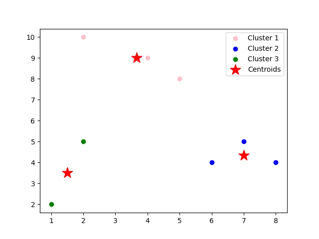

# Clustering Project 2

## Task 1: K-means on Toy Problem (Points on Cartesian plane)

This task uses a small set of points in the Cartesian plane and applies K-means clustering to group them into three clusters. The k-mean algorithm is written manually without using any standar library(eg. scikit learn) for better understanding the basics of K-means. 

### Given points

- `[2, 10]`
- `[2, 5]`
- `[8, 4]`
- `[5, 8]`
- `[7, 5]`
- `[6, 4]`
- `[1, 2]`
- `[4, 9]`

### Initial centroids

- `C1 = [2, 10]`
- `C2 = [5, 8]`
- `C3 = [1, 2]`

### Method used

We solve the problem using the K-means algorithm in `task1.py`.

The process is:
1. Assign each point to the nearest centroid.
2. Recalculate the centroid of each cluster.
3. Repeat until the centroids stop changing meaningfully.

The stopping strategy is:
- stop when `np.allclose(centroids, new_centroids, atol=tol)` becomes true,
- where `tol = 1e-4`,
- and `max_iter = 100` acts as a safety limit.
  
## Clustering Plot
This is the result of the clustering acheived form utilizing the k-means algorithm. 

### Answers to the questions

#### 1. How many iterations are needed to complete the clustering task?
The clustering task completed in **4 iterations**.

#### 2. What is your team’s strategy to stop the iterations?
The iterations stop when the centroid positions no longer change significantly. In the code, this is checked using `np.allclose(..., atol=1e-4)`. A maximum iteration limit is also used to avoid infinite looping.

#### 3. What do the clustering results look like?
The final cluster groups are:

- **Cluster 1**: `[2, 10]`, `[5, 8]`, `[4, 9]`
- **Cluster 2**: `[8, 4]`, `[7, 5]`, `[6, 4]`
- **Cluster 3**: `[2, 5]`, `[1, 2]`

The final centroid points are:

- **Centroid 1**: `[3.66666667, 9.0]`
- **Centroid 2**: `[7.0, 4.33333333]`
- **Centroid 3**: `[1.5, 3.5]`

### Conclusion

The clustering looks valid because the points inside each cluster are close to one another, and each final centroid is located near the center of its group.

