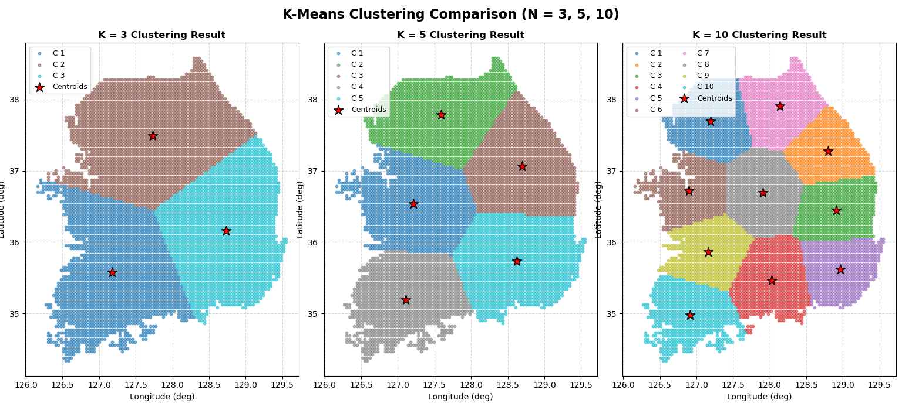

# Task 2: Even Distribution in South Korea Territory

This task generates evenly distributed vertiport-style points inside the South Korea territory polygon.

## Goal

Use the territory boundary from `data/Data_South_Korea_territory.csv`, sample many interior points, and run K-means to place `N` evenly distributed centroids inside the territory.

## Script

- `task2_Suwan.py`

## Method

1. Read the territory boundary CSV.
2. Build a polygon from the boundary points.
3. Rejection-sample interior points inside the polygon.
4. Run K-means on the sampled interior points.
5. Save the final centroid positions.

## Problem and Strategy

The main challenge is that the territory is not a simple rectangle, so we cannot place centroids by hand. Instead, we first create many random points inside the polygon and then cluster those interior samples. This gives centroids that are spread out evenly while still staying inside the territory.

The strategy is:

- use `shapely` to build the polygon,
- rejection-sample interior points,
- apply K-means,
- and use the K-means centroids as the final evenly distributed locations.

## Run

Example for 3, 5, 10 points:

## Output

- Plot window showing the territory, rejection samples ,interior samples, and centroids

## Plot

The figure below shows the South Korea territory boundary, Full mesh grid, Filtered grid(inside territory ,and the final K-means centroids.

## Explanation of the Plot

- The red outline is the territory polygon.
- The faint gray points are the rejection-sampled points.
- The blue points are the points that located inside territory
- The red stars are the final K-means centroids.

The plot shows that the centroids are spread out across the territory while still remaining inside the boundary. This is the goal of the task: to generate evenly distributed vertiport-style points rather than placing them manually.

## Notes

- The script uses `shapely` for polygon handling.
- `random.seed` is fixed in the script for reproducibility.
